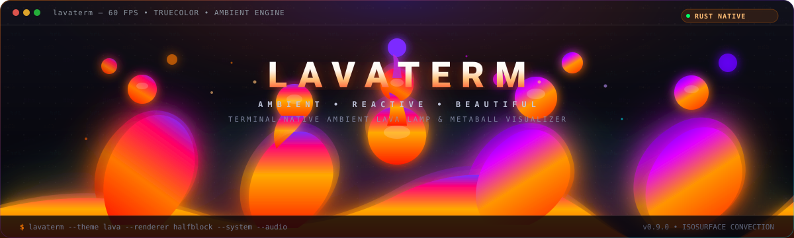

# LavaTerm 🌋

[](https://github.com/githubuser2777/ZenLavaTerm/actions/workflows/ci.yml)
[](https://github.com/githubuser2777/ZenLavaTerm/actions/workflows/autofix.yml)
[](https://github.com/githubuser2777/ZenLavaTerm/releases)
[](https://opensource.org/licenses/MIT)
[](https://www.rust-lang.org/)

> **A high-performance, terminal-native ambient lava lamp & metaball visualizer written in Rust.**
>
> LavaTerm brings soothing, organic fluid dynamics to your terminal using 2D scalar field isosurfaces, sub-pixel Unicode block and Braille character packing, and 24-bit True Color gradients. Designed for aesthetic desktop ricing, ambient computing, and real-time audio and system-reactive observability.



---

## Table of Contents

- [Key Features](#key-features)
- [Tech Stack](#tech-stack)
- [Prerequisites](#prerequisites)
- [Installation & Quick Start](#installation--quick-start)
  - [Desktop Installers (Recommended)](#desktop-installers-recommended)
  - [Build from Source via Cargo](#build-from-source-via-cargo)
- [Usage](#usage)
  - [Standard Mode](#standard-mode)
  - [Running with Aesthetic Themes](#running-with-aesthetic-themes)
  - [Running with High-Density Braille Renderer](#running-with-high-density-braille-renderer)
  - [Ambient System-Reactive Observability](#ambient-system-reactive-observability)
  - [Audio-Reactive Music Visualizer](#audio-reactive-music-visualizer)
  - [Interactive Keybindings](#interactive-keybindings)
  - [Headless Mode (CI / Scripting)](#headless-mode-ci--scripting)
- [CLI Reference](#cli-reference)
- [Configuration](#configuration)
  - [Configuration File Resolution](#configuration-file-resolution)
  - [Full TOML Configuration Schema](#full-toml-configuration-schema)
  - [Configuration Parameter Reference](#configuration-parameter-reference)
- [Theme Engine & Desktop Ricing](#theme-engine--desktop-ricing)
  - [Built-In Curated Presets](#built-in-curated-presets)
  - [Auto-Detection Engine (`--theme auto`)](#auto-detection-engine---theme-auto)
  - [Pywal & Wallust Dynamic Color Extraction](#pywal--wallust-dynamic-color-extraction)
  - [Custom Theme Files (JSON & TOML)](#custom-theme-files-json--toml)
- [System & Audio Reactive Modes](#system--audio-reactive-modes)
  - [Ambient System Observability (`--system`)](#ambient-system-observability---system)
  - [Audio-Reactive Music Visualizer (`--audio`)](#audio-reactive-music-visualizer---audio)
- [Architecture & Deep Technical Design](#architecture--deep-technical-design)
  - [Directory Structure](#directory-structure)
  - [Unidirectional Data Pipeline](#unidirectional-data-pipeline)
  - [Mathematical Physics & Thermodynamic Model](#mathematical-physics--thermodynamic-model)
  - [Scalar Field Isosurface Evaluation](#scalar-field-isosurface-evaluation)
  - [Sub-Pixel Character Packing & Renderers](#sub-pixel-character-packing--renderers)
  - [Buffer Management & Terminal I/O Performance](#buffer-management--terminal-io-performance)
- [Development, Testing & Benchmarking](#development-testing--benchmarking)
  - [Development Workflow (`cargo run`)](#development-workflow-cargo-run)
  - [Available Cargo Commands](#available-cargo-commands)
  - [Running Tests](#running-tests)
  - [Running Performance Benchmarks](#running-performance-benchmarks)
  - [Running Standalone Examples](#running-standalone-examples)
- [Cross-Platform Packaging & Distribution](#cross-platform-packaging--distribution)
  - [Official Desktop Release Matrix](#official-desktop-release-matrix)
  - [Release Verification & Integrity](#release-verification--integrity)
- [Troubleshooting](#troubleshooting)
  - [Colors Appear Washed Out or Broken](#colors-appear-washed-out-or-broken)
  - [Terminal Cursor Disappears or Garbled Output on Exit](#terminal-cursor-disappears-or-garbled-output-on-exit)
  - [High CPU Usage or Frame Stutter](#high-cpu-usage-or-frame-stutter)
  - [System Reactive Mode Shows Default Metrics](#system-reactive-mode-shows-default-metrics)
- [Contributing](#contributing)
- [License](#license)

---

## Key Features

- 🫧 **Real-Time Metaball Physics**: Continuous 2D scalar potential fields with thermodynamic buoyancy, gravity, viscous damping, boundary elastic reflections, and Brownian thermal noise.
- 🖼️ **Sub-Pixel Multi-Renderer Pipeline**:
  - **Half-Block (`▀`)**: Packs two vertical virtual pixels per character cell for a $1:1$ square aspect ratio.
  - **Full-Block (`█`)**: Classic terminal cell renderer with 24-bit True Color foreground mapping.
  - **Braille Matrix (`⠿`)**: Ultra-high-density $2 \times 4$ dot matrix encoding using Unicode Braille Patterns (`U+2800`..`U+28FF`).
- 🎨 **Desktop Ricing & Theme Engine**:
  - **12 Curated Presets**: `lava`, `ocean`, `cyberpunk`, `synthwave`, `nord`, `forest`, `monochrome`, `matrix`, `sunset`, `dracula`, `catppuccin`, and `tokyo-night`.
  - **Dynamic Wallpaper Extraction**: Integrates seamlessly with **Pywal** (`~/.cache/wal/colors.json`) and **Wallust** (`~/.cache/wallust/colors.json`).
  - **Auto-Detection (`--theme auto`)**: Automatically inspects desktop color caches with smooth fallback.
  - **Custom Files**: Load custom JSON and TOML 4-anchor color schemes.
- 📊 **Ambient System Observability (`--system`)**: Zero-clutter hardware monitoring reading native operating system telemetry (Linux `/proc` and `/sys`, Windows Win32 API `GetSystemTimes`/`GlobalMemoryStatusEx`/`GetSystemPowerStatus`, and macOS Mach kernel `host_statistics64`). CPU load drives fluid turbulence, RAM usage expands blob volume, and battery charge regulates thermal buoyancy.
- 🎵 **Audio-Reactive Mode (`--audio`)**: Zero-dependency Cooley-Tukey Radix-2 FFT and Hann-windowed spectrum analyzer isolating Bass ($20-250\text{ Hz}$), Midrange ($250-4000\text{ Hz}$), and Treble ($4-20\text{ kHz}$) into fluid kinematics.
- 🖱️ **Interactive Physics & Live Modulation**: Click to detonate radial shockwaves, drag to stir fluid currents with momentum transfer, right click for localized thermal pulses, scroll for buoyancy pressure surges, and type characters for acoustic wave ripples.
- 🪟 **Multiplexer & Widget Integration (`tmux` / `zellij`)**:
  - **Compact Mode (`--compact`)**: Automatically scales particle counts and radii for small split-panes without particle saturation.
  - **Low-Overhead Widget (`--widget`)**: Ambient desktop widget mode running at an efficient 15 FPS.
  - **Inline Mode (`--inline`)**: In-place interactive animation without switching to alternate screens.
  - **Status-Bar Snapshot (`--snapshot`)**: Single-shot ANSI True Color frame serializer for direct embedding in `tmux` status bars (`status-right`), `zellij` plugins, polybar, and scripts.
- ⚡ **Zero-Allocation Inner Loop & Decoupled Core**: Pure simulation core operates with zero terminal dependencies, enabling deterministic testing, headless execution, and micro-benchmarking.
- 🛡️ **Fail-Safe Cross-Platform Terminal Handling**: Raw mode initialization with custom panic hooks, Unix `SIGINT`/`SIGTERM` handlers, and Windows console control routines (`SetConsoleCtrlHandler`) that restore cursor visibility, disable mouse capture, and exit alternate screens cleanly across Linux, macOS, and Windows.

---

## Tech Stack

| Layer | Technology | Purpose |
|---|---|---|
| **Language** | [Rust 2021 Edition](https://www.rust-lang.org/) (1.75+) | Memory safety, zero-cost abstractions, maximum concurrency |
| **Terminal I/O** | [`crossterm` 0.28](https://docs.rs/crossterm) | Raw mode, alternate screen, event polling, ANSI formatting |
| **CLI Parser** | [`clap` 4.5](https://docs.rs/clap) (with derive) | Ergonomic command-line arguments and flags |
| **Configuration** | [`serde` 1.0](https://serde.rs/), [`toml` 0.8](https://docs.rs/toml), [`serde_json` 1.0](https://docs.rs/serde_json) | TOML configuration, Pywal/Wallust JSON parsing |
| **Error Handling** | [`thiserror` 1.0](https://docs.rs/thiserror) | Idiomatic, strongly-typed domain errors |
| **Benchmarking** | [`criterion` 0.5](https://docs.rs/criterion) | Statistical micro-benchmarks for field math and render loops |
| **CI / CD** | GitHub Actions | Automated linting, multi-platform test matrices, and cross-compiled release packaging |

---

## Prerequisites

Before building or running LavaTerm, ensure your environment meets the following requirements:

1. **Rust Toolchain**: Rust 1.75 or higher (`cargo`, `rustc`). Install via [rustup](https://rustup.rs/):
   ```bash
   curl --proto '=https' --tlsv1.2 -sSf https://sh.rustup.rs | sh
   ```
2. **Terminal Emulator with True Color (24-bit ANSI) Support**:
   - **Linux**: Alacritty, Kitty, WezTerm, Ghostty, Foot, GNOME Terminal, Konsole, XFCE Terminal.
   - **macOS**: iTerm2, Kitty, Alacritty, WezTerm, Ghostty, Terminal.app (macOS 13+).
   - **Windows**: Windows Terminal, WezTerm, Alacritty.
3. **Unicode Font**: A modern monospace font with Unicode Symbols and Braille Patterns (e.g. JetBrains Mono, Fira Code, Cascadia Code, Nerd Fonts).

## Installation & Quick Start

### Desktop Installers (Recommended)

Pre-built standalone installers and packages are available on the [GitHub Releases](https://github.com/githubuser2777/ZenLavaTerm/releases) page for each official release:

- **Linux**:
  - **AppImage (Portable)**: Download `ZenLavaTerm-v<VERSION>-linux-x86_64.AppImage`, run `chmod +x`, and execute directly.
  - **DEB (Debian/Ubuntu)**: Download `ZenLavaTerm-v<VERSION>-linux-x86_64.deb` and install via `sudo apt install ./ZenLavaTerm-v*-linux-x86_64.deb`.
- **Windows**:
  - **MSI Installer**: Download `ZenLavaTerm-v<VERSION>-windows-x86_64.msi` and run the installer to set up `lavaterm` in `Program Files` and register system `PATH`.
- **macOS**:
  - **Universal DMG**: Download `ZenLavaTerm-v<VERSION>-macos-universal.dmg`, open the disk image, and drag `ZenLavaTerm` to your Applications folder.

For detailed platform-specific installation steps, see the [Packaging & Installation Guide](docs/packaging.md).

### Build from Source via Cargo

For developers or distributions without pre-compiled binaries:

```bash
# Install directly via Cargo
cargo install --locked --git https://github.com/githubuser2777/ZenLavaTerm.git

# Or build from local clone
git clone https://github.com/githubuser2777/ZenLavaTerm.git
cd ZenLavaTerm
cargo install --path .
```

> **Note:** `cargo install` compiles the release binary and installs `lavaterm` into `$HOME/.cargo/bin` (Linux/macOS) or `%USERPROFILE%\.cargo\bin` (Windows). Ensure this directory is in your `PATH`.

---

## Usage

Once installed, simply run `lavaterm` with any desired options, renderer engines, or themes:

### Standard Mode
Runs with the default warm `lava` palette at 30 FPS using Half-Block rendering:

```bash
lavaterm
```

### Running with Aesthetic Themes
```bash
# Cyberpunk neon yellow & hot magenta
lavaterm --theme cyberpunk

# 80s Synthwave outrun sunset
lavaterm --theme synthwave

# Deep oceanic bioluminescence
lavaterm --theme ocean

# Arctic Nord frosty blues
lavaterm --theme nord

# Terminal phosphor Matrix green
lavaterm --theme matrix

# Automatically match your desktop wallpaper (Pywal / Wallust)
lavaterm --theme auto
```

### Running with High-Density Braille Renderer
```bash
lavaterm --renderer braille --theme ocean --fps 60
```

### Ambient System-Reactive Observability
Transform CPU load, RAM usage, and battery levels into fluid motion:

```bash
lavaterm --system --theme matrix
```

### Audio-Reactive Music Visualizer
Respond dynamically to music and rhythmic beats:

```bash
lavaterm --audio --theme synthwave
```

---

### Interactive Keybindings & Mouse Gestures

While LavaTerm is running in your terminal, interact directly with the fluid in real-time:

#### Keyboard Controls
| Keybinding | Action | Description |
|---|---|---|
| <kbd>q</kbd>, <kbd>Q</kbd>, <kbd>Esc</kbd> | **Quit** | Cleanly exits LavaTerm, restores terminal raw mode, disables mouse capture, and shows cursor. |
| <kbd>Ctrl</kbd> + <kbd>c</kbd> | **Quit** | Interrupt signal handler for immediate clean exit. |
| <kbd>Space</kbd>, <kbd>p</kbd>, <kbd>P</kbd> | **Pause / Resume** | Toggles simulation physics stepping on or off. |
| <kbd>+</kbd>, <kbd>=</kbd>, <kbd>↑</kbd>, <kbd>→</kbd> | **Speed Up** | Increases upward convective buoyancy ($+0.1$, clamped to $3.0$). |
| <kbd>-</kbd>, <kbd>_</kbd>, <kbd>↓</kbd>, <kbd>←</kbd> | **Slow Down** | Decreases upward convective buoyancy ($-0.1$, clamped to $0.1$). |
| <kbd>r</kbd>, <kbd>R</kbd> | **Reset** | Resets all metaball positions, velocities, and temperatures. |
| <kbd>a</kbd>–<kbd>z</kbd>, <kbd>0</kbd>–<kbd>9</kbd>, symbols | **Ripple Wave** | Non-command character keys (without Ctrl/Alt modifiers) inject harmonic acoustic ripples and thermal vibrations. |

#### Mouse Controls
| Gesture | Action | Description |
|---|---|---|
| **Left Click** | **Detonate Shockwave** | Emits a radial explosive impulse from the click coordinates, repelling nearby blobs. |
| **Left Click + Drag** | **Stir Fluid** | Transfers directional momentum along the drag displacement vector within the influence radius. |
| **Right Click** | **Thermal Pulse** | Injects a concentrated burst of heat at the cursor location without modifying drag state. |
| **Scroll Up / Down** | **Chamber Pressure** | Increases or decreases global convective buoyancy pressure. |

---

### Headless Mode (CI / Scripting)

LavaTerm includes a headless mode that steps the simulation and evaluates virtual rasterization without taking over the TTY or entering alternate screen mode. This is useful for automated testing, benchmarks, and container environments:

```bash
lavaterm --headless --frames 60 --theme cyberpunk
```

**Example Output:**
```text
Starting LavaTerm headless simulation (60 frames, system=false, audio=false)...
  [Frame 001/060] Sim Time: 0.03s | Blobs: 12 | Active pixels in canvas: 894
  [Frame 021/060] Sim Time: 0.70s | Blobs: 12 | Active pixels in canvas: 912
  [Frame 041/060] Sim Time: 1.37s | Blobs: 12 | Active pixels in canvas: 928
  [Frame 060/060] Sim Time: 2.00s | Blobs: 12 | Active pixels in canvas: 905
  Headless simulation completed successfully.
```

---

## CLI Reference

```text
LavaTerm: Terminal-native ambient lava lamp visualizer.

Usage: lavaterm [OPTIONS]

Options:
  -c, --config <PATH>        Path to custom TOML configuration file
  -r, --renderer <TYPE>      Renderer backend: halfblock | block | braille [default: halfblock]
  -t, --theme <THEME>        Theme preset, auto-detect, or theme file path 
                             (e.g. ocean, cyberpunk, synthwave, auto, pywal, wallust, /path/to/theme.json)
      --fps <FPS>            Target frames per second (1-240) [default: 30]
      --blobs <COUNT>        Number of metaball blobs (1-128) [default: 12]
      --compact              Force compact geometry & profile scaling
      --widget               Run as low-overhead ambient widget (default 15 FPS, compact physics)
      --inline               Run inline in terminal without entering alternate screen
      --snapshot             Render a single ANSI frame to stdout and exit
      --width <COLS>         Explicit viewport width (columns)
      --height <ROWS>        Explicit viewport height (rows)
      --system               Enable ambient system-reactive visualizer mode (CPU/RAM/Battery)
      --audio                Enable audio-reactive visualizer mode (FFT spectrum analyzer)
      --no-mouse             Disable mouse click shockwaves, dragging, and scroll pressure
      --no-ripple            Disable keyboard ripples on character keypresses
      --shockwave-force <F>  Multiplier for mouse click shockwave force [default: 1.0]
      --stir-force <F>       Multiplier for mouse drag stirring force [default: 1.0]
      --headless             Run headless simulation without taking over TTY (useful for testing/CI)
      --frames <COUNT>       Number of frames to step when in headless mode [default: 60]
  -h, --help                 Print help information
  -V, --version              Print version information
```

---

## Configuration

### Configuration File Resolution

LavaTerm resolves configuration in the following order of precedence:

1. **CLI Flags**: Arguments passed via command line (e.g. `--theme`, `--fps`, `--renderer`) always take highest priority.
2. **Custom File (`-c / --config <PATH>`)**: Explicit configuration path supplied at runtime.
3. **Platform Default Configuration Path**:
   - **Linux / Unix**: `$XDG_CONFIG_HOME/lavaterm/config.toml` (defaults to `~/.config/lavaterm/config.toml`).
   - **macOS**: `$HOME/Library/Application Support/lavaterm/config.toml` (fallback to `~/.config/lavaterm/config.toml` or `$XDG_CONFIG_HOME`).
   - **Windows**: `%APPDATA%\lavaterm\config.toml` (fallback to `%USERPROFILE%\AppData\Roaming\lavaterm\config.toml` or `%USERPROFILE%\.config\lavaterm\config.toml`).
4. **Built-in Hardcoded Defaults**: Safe fallback values when no configuration file is present.

To generate your personal config file:

```bash
# Linux / macOS
mkdir -p ~/.config/lavaterm
cp docs/configuration.md ~/.config/lavaterm/config.toml # Or create your custom config

# Windows (PowerShell)
New-Item -ItemType Directory -Force -Path "$env:APPDATA\lavaterm"
```

---

### Full TOML Configuration Schema

```toml
# =============================================================================
# LavaTerm Configuration File (~/.config/lavaterm/config.toml)
# =============================================================================

[simulation]
# Number of metaball blobs in the lava fluid chamber (1..128)
blobs = 12

# Gravitational downward acceleration constant
gravity = 0.12

# Thermal buoyancy upward acceleration multiplier
buoyancy = 0.80

# Fluid viscosity drag damping factor (0.0..1.0)
viscosity = 0.93

# Brownian thermal noise perturbation amplitude
noise = 0.15

# Isosurface scalar field density threshold
threshold = 1.00

# Thermal transfer rate with chamber boundaries (> 0.0 to 5.0)
thermal_transfer_rate = 0.40

[render]
# Renderer backend: "halfblock" (default), "block", or "braille"
renderer = "halfblock"

# Target animation frame rate (1..240)
fps = 30

# Enable smooth multi-stop color gradient interpolation
gradient = true

[theme]
# Active theme preset name ("lava", "ocean", "cyberpunk", "synthwave", "nord",
# "forest", "monochrome", "matrix", "sunset", "dracula", "catppuccin", "tokyo-night"),
# or dynamic extractors: "auto", "pywal", "wallust"
name = "cyberpunk"

# Optional explicit path override to a JSON/TOML theme file
# path = "/home/user/.config/lavaterm/custom_theme.json"

[palette]
# Fallback custom RGB palette if [theme] is omitted
bottom = "#ff3b00"      # Fiery heat source
middle = "#ff7a00"      # Convective amber
top = "#7b2cff"         # Cooled purple apex
background = "#0d0d15"  # Chamber background

[reactive]
# Enable ambient system observability (CPU/RAM/Battery/IO)
enabled = false

# Metric polling interval in milliseconds
poll_interval_ms = 500

[audio]
# Enable audio-reactive FFT spectrum analyzer mode
enabled = false

# Tempo BPM for synthetic beat generator fallback
bpm = 120.0

[widget]
# Enable compact layout scaling by default
compact = false

# Target frame rate in widget mode (1..240)
fps = 15

# Run in inline mode without alternate screen by default
inline = false

# Optional fixed width and height dimensions for status bars / widgets
# width = 24
# height = 8

# Automatically adapt particle count and radius in compact mode
adapt_blobs = true

[interaction]
# Enable mouse click shockwaves, dragging, and scroll pressure
mouse = true

# Enable keyboard typing wave ripples
keyboard_ripple = true

# Multiplier for mouse click shockwave force (0.1..10.0)
shockwave_force = 1.0

# Multiplier for mouse drag stirring force (0.1..10.0)
stir_force = 1.0
```

---

### Configuration Parameter Reference

| Section | Parameter | Type | Default | Range / Allowed Values | Description |
|---|---|---|---|---|---|
| `[simulation]` | `blobs` | Integer | `12` | `1..128` | Total number of interacting metaball particles. |
| `[simulation]` | `gravity` | Float | `0.12` | `0.0..5.0` | Constant downward acceleration pulling cooled fluid down. |
| `[simulation]` | `buoyancy` | Float | `0.80` | `0.0..5.0` | Upward convective force applied to heated fluid particles. |
| `[simulation]` | `viscosity` | Float | `0.93` | `0.0..1.0` | Fluid drag damping; higher values mean thicker, slower fluid. |
| `[simulation]` | `noise` | Float | `0.15` | `0.0..2.0` | Brownian thermal velocity perturbation strength. |
| `[simulation]` | `threshold`| Float | `1.00` | `0.1..10.0` | Isosurface threshold $T$ defining the boundary of the fluid. |
| `[simulation]` | `thermal_transfer_rate` | Float | `0.40` | `> 0.0..5.0` | Rate of thermal transfer with chamber boundaries. |
| `[render]` | `renderer` | String | `"halfblock"` | `"halfblock"`, `"block"`, `"braille"` | Terminal character rasterization engine. |
| `[render]` | `fps` | Integer | `30` | `1..240` | Target frame rate capped via precise sleep timers. |
| `[render]` | `gradient` | Boolean | `true` | `true`, `false` | Enable linear gradient interpolation across temperature anchors. |
| `[theme]` | `name` | String | `None` | Preset name, `"auto"`, `"pywal"`, `"wallust"` | Theme preset or dynamic desktop color extractor. |
| `[theme]` | `path` | String | `None` | Valid file path | Direct path to a custom JSON or TOML theme definition. |
| `[palette]` | `bottom` | Hex | `"#ff3b00"` | Hex `#rrggbb` | Bottom heating plate color (hottest fluid). |
| `[palette]` | `middle` | Hex | `"#ff7a00"` | Hex `#rrggbb` | Intermediate temperature fluid color. |
| `[palette]` | `top` | Hex | `"#7b2cff"` | Hex `#rrggbb` | Top chamber cooling zone color (coldest fluid). |
| `[palette]` | `background` | Hex | `"#0d0d15"` | Hex `#rrggbb` | Fluid chamber background empty space color. |
| `[reactive]` | `enabled` | Boolean | `false` | `true`, `false` | Enable ambient hardware telemetry modulation. |
| `[reactive]` | `poll_interval_ms` | Integer | `500` | `100..10000` | Polling frequency for `/proc` and `/sys` virtual files. |
| `[audio]` | `enabled` | Boolean | `false` | `true`, `false` | Enable FFT spectrum analyzer audio reactivity. |
| `[audio]` | `bpm` | Float | `120.0` | `20.0..300.0` | Procedural rhythm generator tempo for testing and demos. |
| `[widget]` | `compact` | Boolean | `false` | `true`, `false` | Force compact profile scaling by default. |
| `[widget]` | `fps` | Integer | `15` | `1..240` | Default frame rate for widget mode. |
| `[widget]` | `inline` | Boolean | `false` | `true`, `false` | Default to in-place inline rendering without alternate screen. |
| `[widget]` | `width` | Integer | `None` | `1..1000` | Optional explicit columns width for widget layouts. |
| `[widget]` | `height` | Integer | `None` | `1..1000` | Optional explicit rows height for widget layouts. |
| `[widget]` | `adapt_blobs` | Boolean | `true` | `true`, `false` | Scale down blob count in small viewports to prevent saturation. |
| `[interaction]` | `mouse` | Boolean | `true` | `true`, `false` | Enable mouse click shockwaves, dragging, and scroll pressure. |
| `[interaction]` | `keyboard_ripple` | Boolean | `true` | `true`, `false` | Enable keyboard typing wave ripples. |
| `[interaction]` | `shockwave_force` | Float | `1.0` | `0.1..10.0` | Multiplier for mouse click shockwave force. |
| `[interaction]` | `stir_force` | Float | `1.0` | `0.1..10.0` | Multiplier for mouse drag fluid stirring momentum transfer. |

---

## Theme Engine & Desktop Ricing

LavaTerm includes a first-class Theme Engine designed specifically for the Unix ricing community. It decouples color palette selection from simulation and rendering.

### Built-In Curated Presets

| Preset Name | Bottom (Hot) | Middle (Warm) | Top (Cold) | Background | Aesthetic Description |
|---|---|---|---|---|---|
| `lava` *(default)* | `#ff3b00` | `#ff7a00` | `#7b2cff` | `#0d0d15` | Classic incandescent lava lamp glowing embers & violet apex |
| `ocean` | `#00f0ff` | `#0077be` | `#0a192f` | `#020b14` | Deep bioluminescent oceanic abyss & electric cyan |
| `cyberpunk` | `#fcee0a` | `#ff0055` | `#7122fa` | `#05050d` | High-contrast neon yellow, hot magenta & electric violet |
| `synthwave` | `#ff2a85` | `#9a48d0` | `#2de2e6` | `#120b22` | 80s outrun sunset glow, laser cyan & twilight purple |
| `nord` | `#88c0d0` | `#5e81ac` | `#81a1c1` | `#2e3440` | Arctic frost, polar mist & Scandinavian pastel blues |
| `forest` | `#55ff77` | `#2e8b57` | `#1b4332` | `#081c15` | Emerald moss, lush pine needles & canopy shadows |
| `monochrome` | `#ffffff` | `#999999` | `#444444` | `#0a0a0a` | High-contrast minimalist crisp grayscale |
| `matrix` | `#a6ff00` | `#00ff41` | `#003b00` | `#0d1117` | Acid lime & phosphor terminal cascade green |
| `sunset` | `#ff4500` | `#ff8c00` | `#4a0e4e` | `#1a0022` | Dusk horizon blazing orange & deep royal plum |
| `dracula` | `#ff79c6` | `#bd93f9` | `#8be9fd` | `#282a36` | Gothic vampire pink, purple & cyan highlights |
| `catppuccin` | `#f5c2e7` | `#cba6f7` | `#89b4fa` | `#1e1e2e` | Catppuccin Mocha soothing pastel tones |
| `tokyo-night` | `#f7768e` | `#bb9af7` | `#7aa2f7` | `#1a1b26` | Tokyo Night neon glow in metropolitan rain |

---

### Auto-Detection Engine (`--theme auto`)

When passing `--theme auto`, LavaTerm automatically probes the environment in the following order:

```text
Check ~/.cache/wal/colors.json (Pywal JSON)
   │ (not found)
   ▼
Check ~/.cache/wal/colors (Pywal flat list)
   │ (not found)
   ▼
Check ~/.cache/wallust/colors.json (Wallust JSON)
   │ (not found)
   ▼
Fallback to "lava" preset
```

---

### Pywal & Wallust Dynamic Color Extraction

LavaTerm integrates directly with dynamic wallpaper theming tools:

```bash
# Force Pywal wallpaper colors
lavaterm --theme pywal

# Force Wallust wallpaper colors
lavaterm --theme wallust
```

**Color Anchor Mapping from 16-Color Schemes:**
- **Background**: Extracted from `special.background` or `colors.color0`.
- **Bottom (Hot)**: Primary vibrant accent (`colors.color1` or `colors.color9`).
- **Middle (Warm)**: Secondary highlight (`colors.color3` or `colors.color11`).
- **Top (Cold)**: Deep accent (`colors.color4` or `colors.color12`).

---

### Custom Theme Files (JSON & TOML)

You can define your own custom 4-stop color palettes in external JSON or TOML files and load them with `lavaterm --theme <PATH>`:

#### JSON Format (`my_theme.json`)
```json
{
  "bottom": "#00ffcc",
  "middle": "#0077ff",
  "top": "#ff0077",
  "background": "#000011"
}
```

#### TOML Format (`my_theme.toml`)
```toml
bottom = "#00ffcc"
middle = "#0077ff"
top = "#ff0077"
background = "#000011"
```

---

## System & Audio Reactive Modes

### Ambient System Observability (`--system`)

LavaTerm transforms background operating system hardware metrics into soothing, non-distracting fluid kinetics:

```text
┌─────────────────────────────────────────────────────────────┐
│                 System Metric Providers                     │
│  - LinuxSystemProvider (/proc/stat, /proc/meminfo, /sys)    │
│  - WindowsSystemProvider (GetSystemTimes, GlobalMemory)     │
│  - MacOSSystemProvider (host_statistics64 Mach kernel)      │
│  - MockSystemProvider (unit & integration testing/fallback) │
└──────────────────────────────┬──────────────────────────────┘
                               │ Polls OS telemetry every N ms
                               ▼
┌─────────────────────────────────────────────────────────────┐
│                 SystemSignals [0.0, 1.0]                    │
│  - cpu_load: f32       - memory_usage: f32                  │
│  - battery_level: f32  - io_activity: f32                   │
└──────────────────────────────┬──────────────────────────────┘
                               │ Modulates fluid physics
                               ▼
┌─────────────────────────────────────────────────────────────┐
│                 Simulation Core (Blobs)                     │
│  - CPU load     ──> Increases thermal turbulence & noise    │
│  - Memory usage ──> Dynamically expands blob volume/radii   │
│  - Battery      ──> Regulates convective speed & buoyancy   │
└─────────────────────────────────────────────────────────────┘
```

#### Physical Metric Mappings

| System Metric | Telemetry Source (Linux) | Telemetry Source (Windows) | Telemetry Source (macOS) | Signal Range | Lava Physical Effect |
|---|---|---|---|:---:|---|
| **CPU Utilization** | `/proc/stat` delta ticks | `GetSystemTimes` (idle vs total) | `host_statistics64` (`HOST_CPU_LOAD_INFO`) | `[0.0, 1.0]` | Modulates Brownian thermal noise & turbulence: $\text{noise} = 0.15 \times (1.0 + 2.5 \times \text{cpu})$. |
| **RAM Usage** | `/proc/meminfo` (`MemTotal` vs `MemAvailable`) | `GlobalMemoryStatusEx` (`ullTotalPhys` vs `ullAvailPhys`) | `host_statistics64` (`HOST_VM_INFO64`) | `[0.0, 1.0]` | Dynamically scales blob volume: $R = R_0 \times (0.85 + 0.40 \times \text{ram})$. |
| **Battery Level** | `/sys/class/power_supply/BAT*/capacity` | `GetSystemPowerStatus` (`BatteryLifePercent`) | Neutral baseline (`1.0`) | `[0.0, 1.0]` | Regulates thermal convection: $\text{buoyancy} = 0.50 + 0.60 \times \text{bat}$. |
| **Disk Storage I/O**| `/proc/diskstats` delta sectors | `GetProcessIoCounters` delta transfer bytes | Baseline (`0.05`) | `[0.0, 1.0]` | Imparts subtle micro-perturbations during active I/O operations. |

---

### Audio-Reactive Music Visualizer (`--audio`)

LavaTerm features a built-in real-time audio visualization engine powered by an in-place Cooley-Tukey Radix-2 Fast Fourier Transform (FFT).

```text
┌─────────────────────────────────────────────────────────────┐
│                  Audio Capture & Ring Buffer                │
│  - LiveAudioProvider (PCM streams) / SyntheticAudioGenerator│
│  - Lock-free PCM circular sample buffer                     │
└──────────────────────────────┬──────────────────────────────┘
                               │ 1024-sample analysis window
                               ▼
┌─────────────────────────────────────────────────────────────┐
│                  Spectrum Analyzer & FFT                    │
│  - Hann windowing function (smooth spectral leakage)        │
│  - In-place Cooley-Tukey Radix-2 FFT (bit-reversal passes)  │
│  - Frequency bin energy integration                         │
└──────────────────────────────┬──────────────────────────────┘
                               │ Produces normalized AudioSignals
                               ▼
┌─────────────────────────────────────────────────────────────┐
│                 Simulation Core (Blobs)                     │
│  - Bass   (20 - 250 Hz)     ──> Upward convective surge     │
│  - Mid    (250 - 4,000 Hz)  ──> Fluid turbulence & noise    │
│  - Treble (4,000 - 20,000 Hz)──> Micro-perturbation jitter  │
└─────────────────────────────────────────────────────────────┘
```

#### Frequency Band Mappings

| Frequency Band | Spectral Range | Lava Physical Effect |
|---|:---:|---|
| **Bass** | $20\text{ Hz} - 250\text{ Hz}$ | Gives powerful upward convective thrust ($\text{buoyancy} = 0.80 + 1.50 \times \text{bass}$) mimicking bass kicks. |
| **Midrange** | $250\text{ Hz} - 4,000\text{ Hz}$ | Modulates Brownian fluid turbulence ($\text{noise} = 0.15 \times (1.0 + 2.5 \times \text{mid})$). |
| **Treble** | $4,000\text{ Hz} - 20,000\text{ Hz}$ | Imparts subtle horizontal velocity jitter to active metaball particles. |

---

## Architecture & Deep Technical Design

### Directory Structure

```text
ZenLavaTerm/
├── Cargo.toml                  # Rust package manifest & release profiles
├── Cargo.lock                  # Pinned dependency graph
├── CHANGELOG.md                # Project release history & versioning
├── CONTRIBUTING.md             # Developer contribution guidelines
├── LICENSE                     # MIT License
├── README.md                   # Comprehensive project documentation
├── rustfmt.toml                # Rust code formatting rules
├── benches/
│   └── field_and_render.rs     # Criterion micro-benchmarks
├── examples/
│   └── minimal_sim.rs          # Standalone simulation & ASCII density demo
├── docs/                       # In-depth architectural & subsystem guides
│   ├── architecture.md         # Data pipeline & module decoupling
│   ├── simulation.md           # Mathematical & physics formulation
│   ├── rendering.md            # Sub-pixel packing & ANSI optimizations
│   ├── configuration.md        # Complete schema specification
│   ├── theme.md                # Theme engine & palette extraction
│   ├── reactive.md             # System observability specification
│   └── audio.md                # Audio FFT & spectrum analyzer details
├── src/
│   ├── lib.rs                  # Library root & public domain error types
│   ├── main.rs                 # CLI entry point, signal loop & TTY management
│   ├── core/                   # Pure mathematical simulation (Zero I/O)
│   │   ├── mod.rs              # Core module re-exports
│   │   ├── metaball.rs         # Blob particle struct & Euclidean metrics
│   │   ├── physics.rs          # Buoyancy, gravity, drag & thermodynamic stepping
│   │   ├── field.rs            # 2D continuous scalar field evaluation
│   │   └── simulation.rs       # Simulation container & deterministic PRNG
│   ├── render/                 # Framebuffer & terminal character renderers
│   │   ├── mod.rs              # Renderer trait & rasterize_simulation
│   │   ├── color.rs            # 24-bit TrueColor Rgb, lerp & ColorPalette
│   │   ├── framebuffer.rs      # Virtual 2D pixel canvas
│   │   ├── halfblock.rs        # ▀ Half-block sub-pixel renderer
│   │   ├── block.rs            # █ Full-block renderer
│   │   └── braille.rs          # ⠿ 2x4 Unicode Braille dot-matrix renderer
│   ├── config/                 # TOML configuration & validation
│   │   ├── mod.rs              # File discovery & loader
│   │   └── schema.rs           # Config structs & serde derivations
│   ├── input/                  # Keyboard input & action mapping
│   │   ├── mod.rs              # Input module re-exports
│   │   └── keyboard.rs         # Crossterm key event -> Action mapping
│   ├── reactive/               # Ambient system observability
│   │   ├── mod.rs              # SystemProvider factory
│   │   ├── signals.rs          # SystemSignals normalized DTO
│   │   ├── provider.rs         # SystemProvider trait & Mock provider
│   │   ├── linux.rs            # Linux /proc & /sys parser
│   │   ├── windows.rs          # Windows Win32 API provider
│   │   └── macos.rs            # macOS Mach kernel provider
│   ├── audio/                  # Audio FFT & spectrum analysis
│   │   ├── mod.rs              # AudioProvider factory
│   │   ├── signals.rs          # AudioSignals normalized DTO
│   │   ├── fft.rs              # Cooley-Tukey FFT & Hann windowing
│   │   ├── ring_buffer.rs      # Lock-free PCM sample ring buffer
│   │   ├── capture.rs          # Live audio provider implementation
│   │   └── provider.rs         # AudioProvider trait & Synthetic generator
│   └── theme/                  # Theme engine & color extraction
│       ├── mod.rs              # Theme engine re-exports
│       ├── preset.rs           # 12 curated theme presets
│       ├── detector.rs         # Automatic desktop theme detector
│       ├── provider.rs         # ThemeProvider trait & resolvers
│       ├── file.rs             # JSON/TOML custom theme file parser
│       ├── pywal.rs            # Pywal color extractor
│       └── wallust.rs          # Wallust color extractor
└── tests/
    └── integration_test.rs     # End-to-end integration test suite
```

---

### Unidirectional Data Pipeline

LavaTerm strictly enforces unidirectional data flow. The physics simulation is fully isolated from terminal I/O, allowing deterministic testing and high-frequency stepping:

```text
┌───────────────────────────────────────────────────────────┐
│                     Input & Telemetry                     │
│  - Keyboard events (Crossterm)                            │
│  - System metrics (/proc/stat, /proc/meminfo)             │
│  - Audio spectrum (FFT bass, mid, treble)                 │
│  - Clock delta time (Instant::now())                      │
└─────────────────────────────┬─────────────────────────────┘
                              │
                              ▼
┌───────────────────────────────────────────────────────────┐
│                      Simulation Core                      │
│  - Thermodynamic convection & buoyancy forces             │
│  - Viscous fluid drag & elastic boundary reflection       │
│  - Deterministic XorShift64 Brownian thermal noise        │
│  - Continuous 2D scalar field potential superposition     │
└─────────────────────────────┬─────────────────────────────┘
                              │
                              ▼
┌───────────────────────────────────────────────────────────┐
│                    Virtual Framebuffer                    │
│  - 2D RGB pixel array (Width x Height)                    │
│  - Normalized space mapping: (x, y) in [0.0, 1.0]         │
│  - Multi-stop color gradient interpolation (lerp)         │
│  - Edge glow & isosurface threshold filtering             │
└─────────────────────────────┬─────────────────────────────┘
                              │
                              ▼
┌───────────────────────────────────────────────────────────┐
│                     Terminal Renderer                     │
│  - Half-block (▀) / Block (█) / Braille (⠿)               │
│  - Sub-pixel cell packing & ANSI SGR color emission       │
│  - State-tracking (omits duplicate escape codes)          │
└─────────────────────────────┬─────────────────────────────┘
                              │
                              ▼
┌───────────────────────────────────────────────────────────┐
│                       TTY Output                          │
│  - Buffered write into std::io::BufWriter (64KB chunks)   │
│  - Single write_all syscall flush per frame               │
│  - Zero flicker / zero screen tearing                     │
└───────────────────────────────────────────────────────────┘
```

---

### Mathematical Physics & Thermodynamic Model

The simulation space is normalized to a continuous 2D coordinate box: $[0.0, 1.0] \times [0.0, 1.0]$, where $Y=0.0$ represents the bottom heating plate and $Y=1.0$ represents the cooled surface.

Each metaball particle $i$ is defined by its state vector:
$$\mathbf{S}_i = \left( \mathbf{p}_i, \mathbf{v}_i, R_i, \Theta_i \right)$$
where $\mathbf{p}_i = (x_i, y_i)$ is position, $\mathbf{v}_i = (v_{x,i}, v_{y,i})$ is velocity, $R_i$ is radius, and $\Theta_i \in [0.0, 1.0]$ is internal temperature.

#### 1. Thermodynamic Convection
Blobs exchange thermal energy with their surroundings:
- **Heating Zone ($y < 0.25$)**:
  $$\frac{d\Theta_i}{dt} = k_{\text{thermal}} \cdot \frac{0.25 - y_i}{0.25}$$
- **Cooling Zone ($y > 0.75$)**:
  $$\frac{d\Theta_i}{dt} = -k_{\text{thermal}} \cdot \frac{y_i - 0.75}{0.25}$$

#### 2. Force Integration
Thermal buoyancy acts upward on hot blobs and downward on cold blobs relative to neutral temperature $\Theta_0 = 0.5$:
$$F_{\text{buoyancy}} = k_{\text{buoyancy}} \cdot (\Theta_i - 0.5)$$
$$a_{y,i} = F_{\text{buoyancy}} - g$$

Viscous drag opposes motion:
$$\mathbf{v}_i(t + \Delta t) = \mathbf{v}_i(t) \cdot (1 - (1 - \mu) \cdot \Delta t)$$

#### 3. Bounded Timestep Integration
$$\Delta t_{\text{effective}} = \min(\Delta t, \Delta t_{\text{max}})$$
$$\mathbf{p}_i(t + \Delta t) = \mathbf{p}_i(t) + \mathbf{v}_i(t + \Delta t) \cdot \Delta t_{\text{effective}}$$

---

### Scalar Field Isosurface Evaluation

The fluid body is generated using the **Metaball (Isosurface)** algorithm. At any test point $(x, y)$, the total scalar field intensity $F(x, y)$ is the superposition of inverse-square potentials from all $N$ metaballs:

$$F(x, y) = \sum_{i=1}^{N} \frac{R_i^2}{(x - x_i)^2 + (y - y_i)^2 + \epsilon}$$

A test point $(x, y)$ is inside the lava fluid if:
$$F(x, y) \ge T$$

The local temperature at any field point $(x, y)$ is computed via field-weighted interpolation:
$$\Theta(x, y) = \frac{\sum_{i=1}^{N} \Theta_i \cdot \frac{R_i^2}{d_i^2 + \epsilon}}{F(x, y)}$$

---

### Sub-Pixel Character Packing & Renderers

Standard terminal character cells have an aspect ratio of approximately $1:2$ (width to height). LavaTerm provides three distinct rendering engines:

#### 1. Half-Block Renderer (`halfblock`) — Default
Packs two vertical pixels $(x, 2y)$ and $(x, 2y+1)$ into a single character cell using the Unicode Upper Half Block `▀` (`U+2580`):
- **Foreground Color**: Top virtual pixel RGB (`\x1b[38;2;<r>;<g>;<b>m`)
- **Background Color**: Bottom virtual pixel RGB (`\x1b[48;2;<r>;<g>;<b>m`)
- **Resolution**: $W_{\text{virtual}} = \text{Cols}$, $H_{\text{virtual}} = 2 \times \text{Rows}$.

```text
Virtual Pixels:       Terminal Cell:
┌─────────────────┐   ┌─────────────────┐
│ Top Pixel (RGB) │   │ ▀ Foreground    │
├─────────────────┤ → ├─────────────────┤
│ Btm Pixel (RGB) │   │ ▄ Background    │
└─────────────────┘   └─────────────────┘
```

#### 2. Full-Block Renderer (`block`)
Uses the Full Block character `█` (`U+2588`) with True Color foreground ANSI escapes:
- **Resolution**: $W_{\text{virtual}} = \text{Cols}$, $H_{\text{virtual}} = \text{Rows}$.

#### 3. Braille Dot-Matrix Renderer (`braille`)
Encodes an ultra-high-resolution $2 \times 4$ sub-pixel matrix into each Unicode Braille pattern (`U+2800`..`U+28FF`):
- **Resolution**: $W_{\text{virtual}} = 2 \times \text{Cols}$, $H_{\text{virtual}} = 4 \times \text{Rows}$ (4x vertical and 2x horizontal resolution).
- Bitmask encoding:
  $$\text{Braille Char} = \text{Base} (0\text{x}2800) + \sum_{k=1}^{8} (\text{dot}_k \cdot \text{bit}_k)$$

---

### Buffer Management & Terminal I/O Performance

1. **State-Tracking ANSI Optimization**: The renderer tracks the active foreground and background color across adjacent cells. If neighboring cells share identical colors, escape sequence emission is skipped, reducing terminal output bandwidth by up to 65%.
2. **Batched `BufWriter`**: All terminal escape sequences and Unicode characters are staged in an in-memory 64 KB `BufWriter`. Flushing occurs exactly once per frame, eliminating cursor jitter, frame tearing, and terminal emulator lag.
3. **Double Buffering**: Prevents unnecessary full-screen clears by repainting in-place via direct ANSI cursor positioning (`\x1b[row;1H`).

---

## Development, Testing & Benchmarking

### Development Workflow (`cargo run`)

For active development, debugging, or testing local changes without installing the binary globally, you can compile and execute directly using Cargo:

```bash
# Run in debug mode
cargo run

# Run optimized release build
cargo run --release

# Run with custom arguments
cargo run --release -- --theme cyberpunk --renderer braille

# Run headless simulation without taking over TTY
cargo run -- --headless --frames 60 --theme cyberpunk
```

---

### Available Cargo Commands

| Command | Purpose |
|---|---|
| `cargo build` | Compile the debug binary in `target/debug/lavaterm`. |
| `cargo build --release` | Compile the production binary with LTO, opt-level 3, and stripped symbols. |
| `cargo run --release` | Build and immediately execute LavaTerm. |
| `cargo test` | Run the complete test suite (105 unit tests + 15 integration tests = 120 tests total). |
| `cargo test --test integration_test` | Run integration tests only. |
| `cargo bench` | Run Criterion micro-benchmarks for field math and renderers. |
| `cargo run --example minimal_sim` | Execute the minimal standalone simulation example. |
| `cargo fmt --check` | Verify Rust formatting compliance against `rustfmt.toml`. |
| `cargo clippy --all-targets` | Run Clippy linter with strict warning enforcement. |

---

### Running Tests

LavaTerm includes comprehensive unit and integration tests verifying all mathematical models, configuration loading, theme parsing, and rendering engines:

```bash
# Run all tests
cargo test

# Run tests with output printed
cargo test -- --nocapture

# Run a specific test
cargo test test_fft_sine_100hz_bass_dominant
```

---

### Running Performance Benchmarks

LavaTerm utilizes [Criterion.rs](https://bheisler.github.io/criterion.rs/book/index.html) to measure execution throughput across field evaluation and terminal rasterization:

```bash
cargo bench
```

**Benchmark Suites:**
- `field_evaluation`: Evaluates scalar potential performance across 6, 12, and 24 blobs over an $80 \times 48$ grid.
- `rasterize_80x48`: Evaluates continuous-to-discrete virtual framebuffer rasterization.
- `renderers`: Benchmarks ANSI encoding throughput for `halfblock`, `block`, and `braille` renderers.

---

### Running Standalone Examples

Run the minimal ASCII density demo without terminal takeover:

```bash
cargo run --example minimal_sim
```

---

## Cross-Platform Packaging & Distribution

### Official Desktop Release Matrix

ZenLavaTerm provides official, minimal desktop installers and packages built automatically via GitHub Actions:

| Platform | Format | Architecture | Canonical Asset Name | Description |
|---|---|---|---|---|
| **Linux** | `.AppImage` | `x86_64` | `ZenLavaTerm-v<VERSION>-linux-x86_64.AppImage` | Standalone portable executable with embedded runtime |
| **Linux** | `.deb` | `x86_64` (amd64) | `ZenLavaTerm-v<VERSION>-linux-x86_64.deb` | Native Debian/Ubuntu installer package |
| **Windows** | `.msi` | `x86_64` | `ZenLavaTerm-v<VERSION>-windows-x86_64.msi` | Windows Installer package with PATH registration |
| **macOS** | `.dmg` | Universal (`arm64` + `x86_64`) | `ZenLavaTerm-v<VERSION>-macos-universal.dmg` | Apple Silicon & Intel Universal Application Bundle |

Every release asset is accompanied by individual `.sha256` checksum files, a consolidated `SHA256SUMS.txt`, and SLSA build provenance attestations.

---

### Release Verification & Integrity

#### Verifying Release Integrity:

```bash
# Linux (verify single asset)
sha256sum -c ZenLavaTerm-v0.11.0-linux-x86_64.AppImage.sha256

# macOS (verify single asset using native shasum)
shasum -a 256 -c ZenLavaTerm-v0.11.0-macos-universal.dmg.sha256

# Linux (verify all assets via consolidated checksum file)
sha256sum -c SHA256SUMS.txt --ignore-missing

# Windows PowerShell
Get-FileHash -Algorithm SHA256 ZenLavaTerm-v0.11.0-windows-x86_64.msi
```

#### Triggering a Release (Maintainers):

```bash
# 1. Ensure Cargo.toml version matches the target tag
git tag -a v0.11.0 -m "Release v0.11.0"
git push origin v0.11.0
```

The release pipeline automatically enforces tag/version consistency, executes cross-platform packaging, generates atomic GitHub Releases, and attaches all verified assets.

---

## Troubleshooting

### Colors Appear Washed Out or Broken

**Symptom:** Colors look like basic 16-color ANSI, dark blues appear black, or strange escape codes appear on screen.

**Cause:** Your terminal emulator does not have True Color (24-bit ANSI) enabled, or the `$COLORTERM` environment variable is not exported.

**Solution:**
1. Verify True Color support in your terminal:
   ```bash
   printf "\x1b[38;2;255;100;0mTRUECOLOR\x1b[0m\n"
   ```
2. Export `COLORTERM` in your `~/.bashrc`, `~/.zshrc`, or shell profile:
   ```bash
   export COLORTERM=truecolor
   export TERM=xterm-256color
   ```
3. Use a modern terminal emulator (Alacritty, Kitty, WezTerm, Ghostty, iTerm2, Windows Terminal).

---

### Terminal Cursor Disappears or Garbled Output on Exit

**Symptom:** After terminating LavaTerm with <kbd>Ctrl</kbd>+<kbd>C</kbd> or during an abort, the terminal prompt cursor is invisible.

**Cause:** Abnormal process termination bypassed terminal cleanup hooks.

**Solution:**
1. LavaTerm includes a built-in panic hook that automatically calls `LeaveAlternateScreen` and `cursor::Show`.
2. If your terminal is ever left in raw mode after an external kill (`kill -9`), run the standard POSIX reset command:
   ```bash
   reset
   # Or manually restore cursor:
   printf "\x1b[?25h\x1b[0m"
   ```

---

### High CPU Usage or Frame Stutter

**Symptom:** CPU usage is higher than expected or fluid animation stutters.

**Cause:** Terminal window is very large (e.g. 4K fullscreen) with an excessive blob count or high FPS.

**Solution:**
1. Cap the frame rate to 30 FPS:
   ```bash
   lavaterm --fps 30
   ```
2. Lower the blob count:
   ```bash
   lavaterm --blobs 8
   ```
3. Use the `halfblock` or `block` renderer instead of `braille` on large terminals:
   ```bash
   lavaterm --renderer halfblock
   ```
4. Ensure you are running the optimized release binary (installed `lavaterm` or `cargo run --release`), as debug builds contain extensive bounds checking and arithmetic verification.

---

### System Reactive Mode Shows Default Metrics

**Symptom:** Running `lavaterm --system` displays constant, unchanging fluid turbulence.

**Cause:** LavaTerm is running in a permission-restricted environment (such as a locked container without `/proc` access or restricted API access), or on an unsupported fallback operating system.

**Solution:**
- On Linux, Windows, and macOS, LavaTerm automatically initializes the platform-native telemetry provider (`LinuxSystemProvider`, `WindowsSystemProvider`, or `MacOSSystemProvider`).
- On unsupported platforms or restricted sandboxes, LavaTerm gracefully degrades to deterministic simulated signals (`MockSystemProvider`) without crashing.
- In Linux containers (Docker), ensure `/proc` is mounted:
  ```bash
  docker run -it --rm -v /proc:/proc:ro lavaterm
  ```

---

## Contributing

We welcome community contributions, bug reports, theme submissions, and feature requests!

1. Read our [CONTRIBUTING.md](CONTRIBUTING.md) and [CODE_OF_CONDUCT.md](CODE_OF_CONDUCT.md).
2. Check existing [GitHub Issues](https://github.com/githubuser2777/ZenLavaTerm/issues) before opening a new issue.
3. Fork the repository and create a feature branch (`git checkout -b feature/amazing-theme`).
4. Ensure code passes formatting and linting checks:
   ```bash
   cargo fmt --check
   cargo clippy --all-targets --all-features -- -D warnings
   cargo test
   ```
5. Commit your changes with clear, descriptive commit messages.
6. Submit a Pull Request targeting the `main` branch.

---

## License

This project is licensed under the **MIT License**. See the [LICENSE](LICENSE) file for the full license text.
